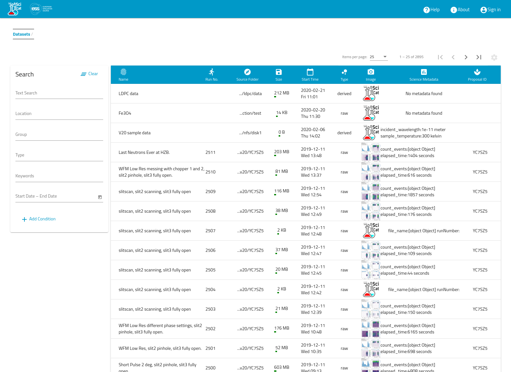
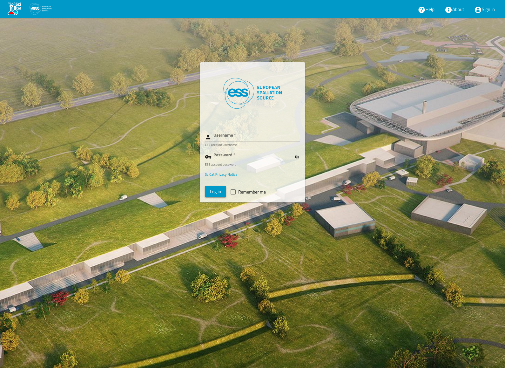
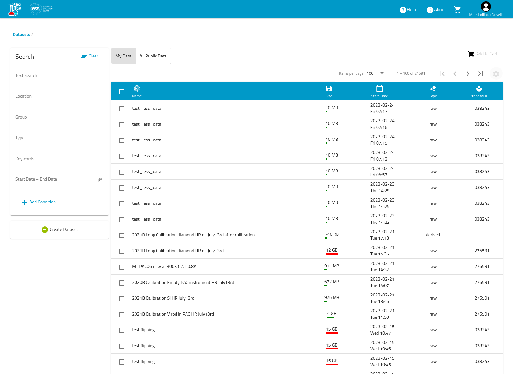
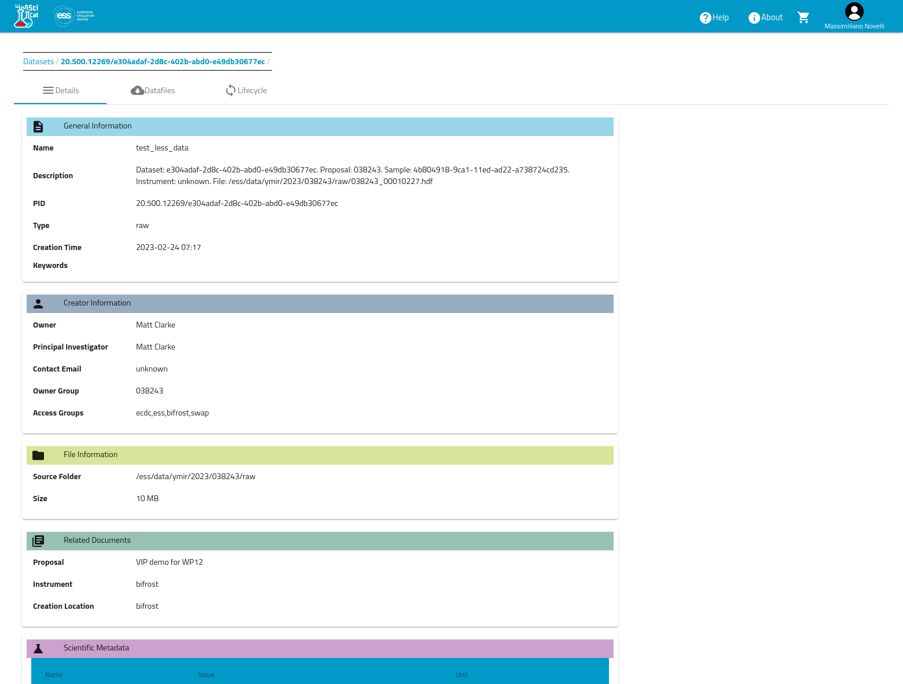
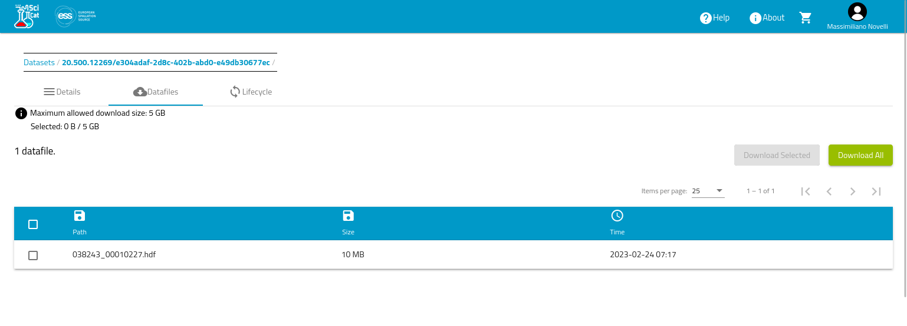
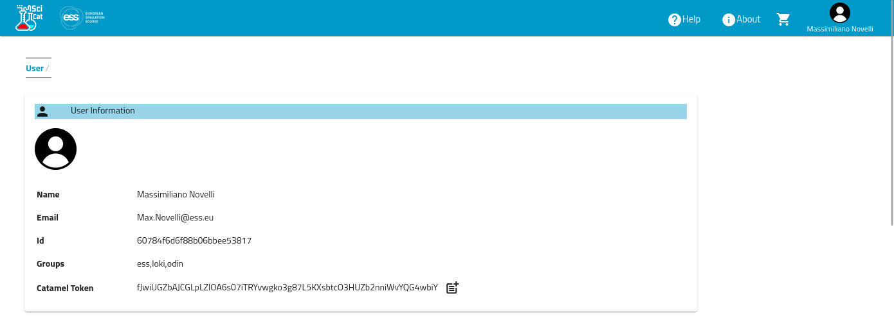

# ECDC workshop
### Lund 2023/02/28

## Preface
This content is all available on [github](http://github.com) in the following repository:
- [SciCat ECDC Workshop](https://github.com/ess-dmsc/scicat-ecdc-workshop)

## Introduction

SciCat is a Scientific Data Catalogue.  
There are more than 5 facilities contributing to the project and more facilities using it. ESS is one of the main contributors, at the moment.

SciCat has two main components: 
- the __backend__, which provide the API and the logic to store and access the metadata related to the datasets,
- the __frontend__, which provides a web UI to the backend.

SciCat is in the middle of backend migration, from v3.x to v4.x. The project aims to make the migration completely transparent to the user.

__IMPORTANT__
SciCat does not provide nor manages the datat files. Data transfer is delegated to the facility IT infrastructure and it is integrated in SciCat at teh facility level. The project is working to provide guidelines and best practises on the topic.

At ESS, there are two main instances of SciCat:
- __production__
  the official instance where ESS users will login to retrieve their data. This instance runs officially released version of SciCat.
- __staging__
  runs the production code and it is used for testing data ingestion and data curation. It shares the same storage and data transfer services as the production instance.

To access SciCAt at ESS, please, follow the following links:
- production: https://scicat.ess.eu
- staging : https://staging.scicat.ess.eu

You should use your ESS login credentials to login.

## UI Overview
Let's explore SCiCat web UI.  
Open ESS staging instance SciCat at https://staging.scicat.ess.eu  

### Public datasets
If you are viewing as an authenticated user, you should be presented with the list of datasets that are _publicly accessible_.  



### Login
Click on the icon on the top right corner of the screen.
Login with your ESS credentials



### My datasets
Once you are logged in, you can see the list of datasets that you have access to.
You can check that you are logged in, by verifying the you name is shown at the top right corner of the page.  



### Dataset Details


### Dataset's Files


## SciCat UI Exercises

### Exercise #1
Retrieve all the dataset acquired at YMIR.

Suggestion: Use __location__ field in the search form

### Exercise #2
Retrieve all the tomography datasets acquired at YMIR.

Suggestion: Use __keywords__ field in the search form

### Exercise #3
Retrieve the derived dataset related to the tomography dataset acquired on YMIR in run 3931

Suggestion: Use __type__ and __text search__ field in the search form

### Exercise #4
Retrieve the derived dataset acquired on YMIR where __run number__ is 3931, __extra entry instrument flir camera image key maximum value__ is equal to 3

Suggestion: Use __add condition__ feature in the search form


## Python Exercises

Exploring how to leverage the python libraries to use the information in SciCat in any workflow in Python and/or Jupyter notebook

### Set up

In order to be able to interact with SciCat API from Python, you can install two different libraries:
- [pySciCat](https://github.com/SciCatProject/pyscicat): lower level library porting SciCat endpoints to python
- [Scitacean](https://github.com/SciCatProject/scitacean): higher level library which aggregates functionalities in user friendly concepts

You can install the previous libraries using the following pip commands
```bash
pip install pyscicat
pip install scitacean
```

Keep in mind that both libraries are work-in-progress.
The documentation can be found here:
- [pySciCat](https://scicatproject.github.io/pyscicat/)
- [Scitacean](https://scicatproject.github.io/scitacean/)


We suggest to use conda and create an environment from the specification file provided in this repository.
The specification file has been created with the following command:
```bash
conda env export --no-builds > specification.yml
```
You can create the conda environment and activate it with the following commands:
```bash
conda env create --name ecdc-workshop --file specification.yml
conda activate ecdc-workshop
```
__IMPORTANT__
The latest version of pySciCat seems to have issues working with our instance of SciCat.

## Retrieve your user token

In order to facilitate accessing SciCat and improve security,  
we can instruct the python libraries to use the authentication token that we already acquired when logging in into the SciCat web UI.  
Here how we can retrieve it:
- Click on the user icon (top right where th euser name is shown)
- Select __Settings__
- In the tile named __User Information__, the last item is the token that we need to copy.
- Click on the __Copy__ icon to the right of the string
- Paste the string in the Jupyter notebook, where it says __\<YOUR_CURRENT_SCICAT_TOKEN\>__   



### Exercise #6
Use Scitacean library to retrieve the dataset from scicat
You can use Exercise #6 template notebook as a start
1. Retrieve a tomography dataset (Select one of the datasets that you found in Exercise #2)
2. Print the dataset information
3. Print the dataset metadata
4. Retrieve the data file
5. Explore the file data structure
